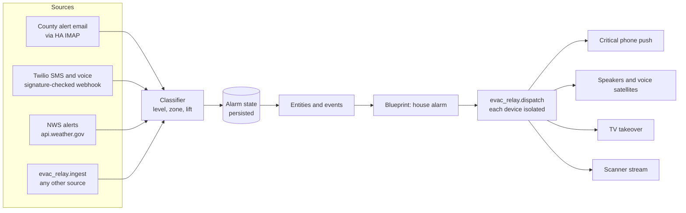

# Evac Relay

Relay county evacuation alerts into Home Assistant and turn them into a house-wide alarm: critical phone alerts, speakers and voice satellites that repeat until someone acknowledges, TVs taken over with a full-screen alert, and a live scanner feed.

> **Evac Relay is not an official alert system.** It relays alerts you already receive. It can be delayed or fail when power, internet, email, or Home Assistant is down, and during a wildfire those are the likely failures. Keep Wireless Emergency Alerts, your county's text and voice alerts, and official apps turned on, and follow official instructions. Provided as-is under the MIT license, with no warranty.
>
> This is an independent, volunteer-maintained personal project. It is not affiliated with, endorsed by, or speaking for any county, fire agency, emergency services organization, alert vendor, or employer. County names and links in the documentation point to public resources only.

## TL;DR

1. Install through HACS as a custom repository, restart, add the **Evac Relay** integration.
2. The setup wizard walks you through: home location, your evacuation zones, county alert sign-up, the email account Home Assistant reads, the scanner stream, and National Weather Service backup.
3. Evac Relay installs the **Evac Relay: house alarm** blueprint. Create one automation from it and pick your speakers, TVs, phones, and scanner speakers.
4. Press **Test alarm** on the Evac Relay device.

Advanced: register a Twilio number with the county so texts and robocalls reach Home Assistant directly. Home Assistant Cloud (Nabu Casa) users get the webhook URL automatically.

## How it works



Detection and response are separate. The integration decides **whether** there is an alert for your zones. The blueprint decides **what the house does**, and you can replace it with your own automations.

### Alert rules

Each level phrase in a message governs the zone IDs that follow it, so "the warning for zone A has been lifted and an evacuation order issued for zone B" raises an order for B, and "Order for A and Warning for B" raises a warning for B. Section-style messages ("EVACUATION ORDER:" then a list of zones) work the same way.

| Situation | Result |
|---|---|
| Order, shelter-in-place, or warning in a clause that names one of your zones | Alarm at that level |
| County email or county text that names **no zone IDs** (for example "north of Hwy 20") | Alarm. Counties already target these by your registered address. Zone IDs are recognized by their shape (same prefix as yours, such as `LAK-`), so boilerplate like "know your zone" doesn't count |
| County robocall (Twilio voice) | Alarm at the level heard. Transcripts rarely spell zone IDs correctly |
| No zones configured | Every evacuation message counts as yours |
| Evacuation language naming only other zones | Event only (`decision: other_zone`) |
| The level phrase itself is lifted, cancelled, reduced, or repopulation begins | Event only (`decision: clearing`). A person clears the alarm |
| Unrelated words such as "airlifted", "classes cancelled", or "Hwy 29 reduced to one lane" | Ignored; a lift has to be tied to the level phrase |
| A level that is only a possibility ("an evacuation order may follow") | Ignored for that level |
| A lower level while a higher one is active | Ignored. Alarms never downgrade automatically |
| A higher level while a lower one is active | Escalates and resets acknowledgement |
| Same text from the same source within 15 minutes | Ignored as a duplicate, unless it would re-raise a cleared alarm |
| Email older than 3 hours | Ignored, so a restart never replays an old order |
| NWS evacuation-type alert | Event only by default, because NWS alerts carry no county zone. Can be set to sound the alarm. Civil Emergency Messages never do |

Classification is keyword-based and deterministic on purpose. A language model misreading "lifted" as "issued" at 3 AM is the failure this avoids. When in doubt, the rules lean toward alarming.

### Alarm behavior (blueprint)

| Level | Repeats | Maximum |
|---|---|---|
| Evacuation order | every 60 seconds | 1 hour |
| Shelter in place | every 5 minutes | 1 hour |
| Evacuation warning | every 10 minutes | 1 hour |

- **Acknowledge** from the phone notification button, the **Acknowledge alarm** button, or `evac_relay.acknowledge`. It stops the repeats; the level and scanner stay on. Each home has its own acknowledge button action.
- **Clear alarm** returns the level to none and stops the scanner speakers. Speaker volume and what the TVs were playing are not restored.
- **Restarts and reloads:** an active, unacknowledged alarm resumes after Home Assistant restarts, and an options change does not stop a running alarm.
- **Failures are isolated:** every device call goes through `evac_relay.dispatch`, so a retired phone or an offline TV is skipped and logged instead of stopping the alarm.
- **Test alarm** plays one cycle with a blue "THIS IS A TEST" screen and labeled announcements, never starts or stops the scanner, and ends itself within 10 minutes, including across restarts. Tests are refused while a real alarm is active, and a real alert arriving during a test takes over.

## Install

1. HACS > Integrations > three-dot menu > Custom repositories > add `https://github.com/FireEMSTech/Evac_Relay` as an Integration.
2. Install **Evac Relay**, restart Home Assistant.
3. Settings > Devices & services > Add integration > **Evac Relay**.

Requires Home Assistant 2026.2 or newer.

## Setup guide

The wizard shows these steps with links. For Lake County, CA see [docs/LAKE_COUNTY.md](docs/LAKE_COUNTY.md). Anything left unfinished stays listed under **Settings > Repairs** until you complete it.

### 1. Zones

Look up your address on the [Genasys Protect map](https://protect.genasys.com/) and copy the zone ID exactly as written. Add other zones you care about, separated by commas or new lines. Place names and entries like "Zone 5" are rejected because they would match unrelated text. `LAK-E12` does not match `LAK-E123`; a suffixed sub-zone such as `LAK-E123-A` does match `LAK-E123`.

### 2. County alerts and email

Enroll in your county's alert system with your home address, and add an email address that Home Assistant will read. A dedicated Gmail account is simplest:

1. Turn on 2-step verification and [create an app password](https://support.google.com/accounts/answer/185833).
2. Create a Gmail filter that labels mail from your county's alert system (for example `evac`). Build it from a real message so the sender is exact.
3. Add the [IMAP integration](https://www.home-assistant.io/integrations/imap/): server `imap.gmail.com`, port 993, folder = that label, search `UNSEEN`. In its options, raise the maximum message size so long alerts aren't cut off (the default keeps 2048 bytes of body text).
4. Select that IMAP account in Evac Relay. The optional sender filter matches the sender address (not the display name, which anyone can fake), and mail that fails DMARC is ignored.

Home Assistant's IMAP integration reports the newest message in the folder. If several alerts land between checks, only the newest is read, which is why the label should contain nothing but county alerts. Handled messages are remembered, so a restart doesn't replay an alert you already cleared.

### 3. Scanner

Paste the direct stream URL of a local fire/EMS feed from [Broadcastify](https://www.broadcastify.com/listen/). Some feeds and ad-free streams need Broadcastify Premium. Play the URL on one speaker first to confirm it works.

### 4. House alarm blueprint

Create an automation from **Evac Relay: house alarm**. When Evac Relay ships a newer blueprint, an unmodified installed copy is replaced automatically and your automations keep their inputs. If you edited the installed copy, Repairs tells you how to take the update instead.

| Input | Notes |
|---|---|
| Phone notify actions | One per line, e.g. `notify.mobile_app_pixel_8`. iOS gets a critical alert; Android uses the alarm channel |
| Speakers | Players that support announcements (Sonos, ESPHome, Music Assistant) pause and resume; others, such as Cast, stop what was playing |
| Voice satellites | Home Assistant Voice PE and other Assist satellites |
| TV remotes | Wakes Apple TV and Android TV Remote devices |
| TVs | Cast devices, and Apple TVs where AirPlay video playback from Home Assistant works, play a full-screen alert video with an alarm tone. On current tvOS the Apple TV integration frequently fails with "not authenticated" or HTTP 500 and only pauses what was playing, so run **Test alarm** before leaving an Apple TV in this list |
| TV overlays | Android/Google TV with the Notifications for Android TV app |
| Scanner speakers | Plays the scanner stream set in Evac Relay. Keep these separate from announcement speakers that don't support announcements |
| Home Assistant LAN address | TVs fetch the alert video from `<address>/evac_relay_media/` |

## Advanced: Twilio

A Twilio number registered with the county as a **text and voice** contact lets alerts reach Home Assistant without email.

- Upgrade the Twilio account. By default Twilio numbers can't receive texts from short codes; Twilio support can enable it for paid accounts, but [delivery is not guaranteed](https://support.twilio.com/hc/en-us/articles/223181668-Can-Twilio-numbers-receive-SMS-from-a-short-code). Register the number for voice too.
- Evac Relay answers calls, records up to 2 minutes, and asks Twilio to transcribe. If transcription fails, Home Assistant shows a notification with the recording link.
- Every request is checked against Twilio's signature using your auth token, with the same default-port handling as Twilio's own SDK. Repeated failures raise a Repairs issue.
- Webhook URL: your Nabu Casa cloudhook, created automatically and retried when the cloud connects. Requests relayed through Nabu Casa are handled and tested. Without Nabu Casa, your public external URL. Set **Public webhook URL override** only if Twilio reaches you through something else (Cloudflare Tunnel, reverse proxy); it must match what Twilio calls exactly. If no public URL is available, Repairs says so, and email and NWS keep working.

Once the URL is known, a notification shows the two URLs to paste into Twilio (`?kind=sms` and `?kind=voice`).

## Entities, events, services

Entity IDs start with `evac_relay_<home name>_`, for example `sensor.evac_relay_home_evacuation_level`.

| Entity | Purpose |
|---|---|
| Evacuation level (sensor) | `none`, `warning`, `shelter`, `order`. Attributes: `active`, `acknowledged`, `test`, `source`, `activated_at`, `zones`, plus `message` and `scanner_url`, which are not stored in history |
| Alarm active (binary sensor) | On while an alarm is active |
| Alarm acknowledged (binary sensor) | On after acknowledgement |
| Last evacuation message (sensor) | Most recent message with evacuation language, any zone |
| NWS last poll (sensor) | Diagnostic. Use it for a watchdog |
| Buttons | Acknowledge, Clear, Test |

Events:

- `evac_relay_message`: every processed message, with `decision` (`alarm`, `duplicate`, `other_zone`, `clearing`, `advisory`, `ignored_lower_level`, `transcription_failed`, `no_evacuation_language`), `level`, `source`, `text`, `matched_zones`.
- `evac_relay_alarm`: an alarm started or escalated, or a test began. The blueprint triggers on this.
- `evac_relay_cleared`: the alarm was cleared.

Services: `acknowledge` (any user), and admin-only `clear`, `test`, `end_test`, `ingest`, `dispatch`. Automations can call all of them.

`ingest` adds sources that aren't built in. It records and emits events but **does not sound the alarm unless `can_trigger: true`**, so a news notification can't set off the house. Only enable it for trusted, filtered sources:

```yaml
triggers:
  - trigger: state
    entity_id: sensor.alert_phone_last_notification
conditions:
  - condition: template
    value_template: "{{ trigger.to_state.attributes.get('package') == 'com.google.android.apps.messaging' }}"
actions:
  - action: evac_relay.ingest
    data:
      source: android_sms
      can_trigger: true
      text: "{{ trigger.to_state.state }} {{ trigger.to_state.attributes.get('android.text', '') }}"
```

## Reliability checklist

- Put the Home Assistant host, network switch, and modem on a UPS.
- Run **Test alarm** monthly.
- Add a watchdog automation on the NWS last poll sensor and on your IMAP sensor becoming unavailable.
- Keep official alerts on every phone. This relays them louder; it does not replace them.

## Roadmap

See [docs/ROADMAP.md](docs/ROADMAP.md): an official IPAWS CAP feed, Genasys Protect zone status, Watch Duty, and more county profiles.

## Development

```bash
pip install -r requirements_test.txt
ruff check . && ruff format --check .
pytest -q
```

`tests/test_classifier.py` and `tests/test_twilio_sig.py` run without Home Assistant. `tests/ha/` loads the integration and the blueprint in a real Home Assistant core.

### Releasing

1. Bump `version` in `custom_components/evac_relay/manifest.json` and add a section to `CHANGELOG.md`.
2. Run the checks above; CI (`.github/workflows/validate.yml`) runs hassfest, the HACS validator, ruff, and pytest on every push.
3. Tag and publish a GitHub release with the same version (`v0.1.0`). HACS offers the update from the release tag.

Bug reports and pull requests are welcome in [Issues](https://github.com/FireEMSTech/Evac_Relay/issues). Please include the `evac_relay_message` event data (Settings > Developer tools > Events) for any misclassified alert, with addresses and personal details removed. See [SECURITY.md](SECURITY.md) for reporting vulnerabilities.
